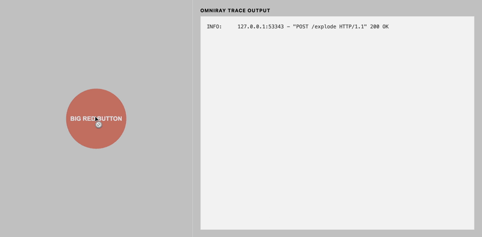

<div align="center">

# OMNIRAY

**Find your bottleneck in one call.**

[](https://github.com/omniviser/omniray/actions/workflows/test.yml)
[](https://github.com/omniviser/omniray/actions/workflows/lint.yml)
[](https://codecov.io/gh/omniviser/omniray)
[](https://pypi.org/project/omniray/)
[](https://pypi.org/project/omniray/)
[](https://opensource.org/licenses/Apache-2.0)

Automatic tracing for Python. See every function call as a live, color-coded tree in your terminal. No decorators, no config files — just one call.

Built and battle-tested at [OMNIVISER](https://omniviser.ai).

</div>

<!-- TODO: Replace with asciinema/VHS recording showing colored terminal output -->
<!-- vhs record demo.tape -o docs/assets/demo.gif -->
<!--
<p align="center">
  
</p>
-->

```
14:23  INFO: ┌─ AuthMiddleware.__call__
14:23  INFO: │  ├─ ┌─ TokenService.authenticate
14:23  INFO: │  │  ├─ ┌─ TokenService._extract_bearer_token
14:23  INFO: │  │  │  ├─ ┌─ SessionStore.get_token
14:23  INFO: │  │  │  │  └─ (850.75ms) SessionStore.get_token [SLOW]
14:23  INFO: │  │  │  └─ (851.25ms) TokenService._extract_bearer_token [SLOW]
14:23  INFO: │  │  ├─ ┌─ JWTValidator.decode_and_verify
14:23  INFO: │  │  │  └─ (335.23ms) JWTValidator.decode_and_verify [SLOW]
14:23  INFO: │  │  ├─ ┌─ PermissionService.check_access
14:23  INFO: │  │  │  └─ (12.43ms) PermissionService.check_access
14:23  INFO: │  │  └─ (1200.07ms) TokenService.authenticate [SLOW]
14:23  INFO: │  ├─ ┌─ OrderView.get
14:23  INFO: │  │  ├─ ┌─ OrderView.check_permissions
14:23  INFO: │  │  │  └─ (0.01ms) OrderView.check_permissions
14:23  INFO: │  │  ├─ ┌─ OrderView.get_context
14:23  INFO: │  │  │  └─ (0.05ms) OrderView.get_context
14:23  INFO: │  │  └─ (32.69ms) OrderView.get
14:23  INFO: │  └─ (1234.08ms) AuthMiddleware.dispatch [SLOW]
14:23  INFO: └─ (1247.51ms) AuthMiddleware.__call__ [SLOW]
```

## Why omniray?

- **Zero-touch instrumentation** — One call wraps every function and method in your codebase. No `@decorator` on each function, no manual setup per module.
- **Live call tree** — See the full call hierarchy in your terminal as it happens, with color-coded timing (green/yellow/red) and `[SLOW]` tags on bottlenecks. Unlike cProfile or py-spy, there's no post-mortem step.
- **OpenTelemetry bridge** — Flip one flag to export spans to Jaeger, Datadog, or any OTel-compatible backend. Cherry-pick which functions get spans.
- **Production-safe** — Never masks exceptions, never wraps dunders or properties, skips already-wrapped functions. Designed to be safe even if accidentally left on.

## Installation

```bash
pip install omniray              # console tracing
pip install omniray[otel]        # + OpenTelemetry spans
pip install omniwrap             # wrapping engine only (custom wrappers)
```

Requires Python >= 3.12. omniray is built on [omniwrap](packages/omniwrap/) — installing omniray installs both.

## Quick Start

```python
from omniwrap import wrap_all
from omniray import create_trace_wrapper

wrap_all(create_trace_wrapper())
```

```bash
OMNIRAY_LOG=true python app.py
```

That's it. Every function call in your codebase now appears as a timed, nested tree in your terminal.

## Features

- **`@trace` decorator** — Per-function control over logging, I/O capture, and OTel spans
- **I/O logging** — Log function arguments and return values for selected functions
- **Conditional skip** — Skip tracing for health checks or noisy functions via `skip_if`
- **Selective OpenTelemetry** — Enable OTel spans on specific functions without global overhead
- **Custom wrappers** — Build your own wrappers with the omniwrap engine
- **Configuration** — Control paths, exclusions, and behavior via `pyproject.toml` and env vars

## Performance

**~250 ns** per wrapped call (omniwrap). **~17 us** per traced call with console output (omniray). A typical request tracing 50 functions adds under 1 ms.

## Safety

omniray **never wraps**: dunder methods, properties, exception classes, already-wrapped functions, imported objects, functions decorated with `@trace`, or its own package. Exceptions are **never masked** — if your function raises, the exception propagates unchanged.

## Documentation

**[Read the full docs](https://omniviser.github.io/omniray/)** — configuration, API reference, performance benchmarks, examples, and more.

## Contributing

See [CONTRIBUTING.md](CONTRIBUTING.md) for development setup and guidelines.

## License

Apache 2.0 — see [LICENSE](LICENSE) for details.
